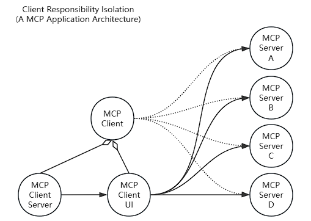

# 客户端责任隔离制(Client Responsibility Isolation)
    这是一种基于MCP设计的应用架构，它帮助安全的构建MCP客户端和MCP服务端。
    An application architecture based on MCP that helps to securely building the MCP client and the MCP server.

# 架构图(Architecture Diagram)

# 架构描述(Architecture Description)
## 背景(Background)
    现有的MCP架构，仅依靠MCP-Client(MC)和MCP-Server(MS)两个部分，对于大多数非局域网应用来说，存在一定的安全风险，
    比如MS响应数据被劫持，或是MC请求被拦截导致获取错误结果。另一个则是网络通信障碍，比如用户不得不在本地部署一个ChatUI才能访问MS，
    否则若是用户在局域网，而ChatUI是公网的BS应用，则用户无法通过ChatUI访问MS。
## 解决方案(Solution)
    将现有的MCP-Client拆分为 MCP-ClientServer(MCS)和MCP-ClientUI(MCUI)以及MCP-Server(MS)三个部分:
    MCS负责系统信息管理以及与LLM通信，通过MCUI实现与MCS的间接通信，并且通信内容只会有请求URL，请求头，密文(若MCS提供了公钥)以及回调地址。
    MS则负责响应MCUI传递过来的请求，对密文进行解密，并执行相应的程序后根据MCS的公钥对执行结果进行加密，返回给MCUI。
    MCUI除了负责用户与系统的交互外，还作为MCS与MS之间的代理，实现MCS与MS之间的通信，即使MS部署在内网也一样可行。

